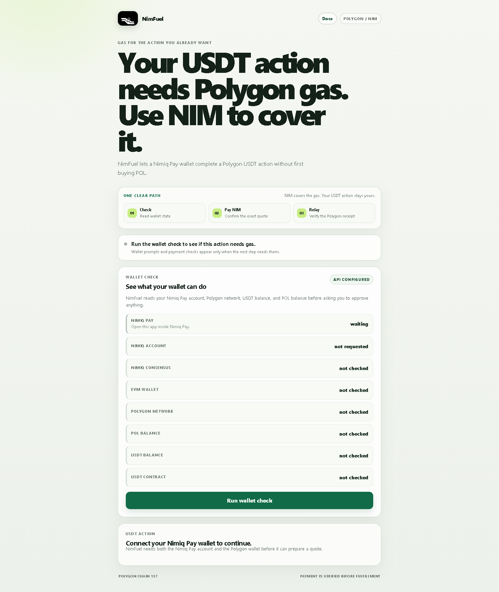
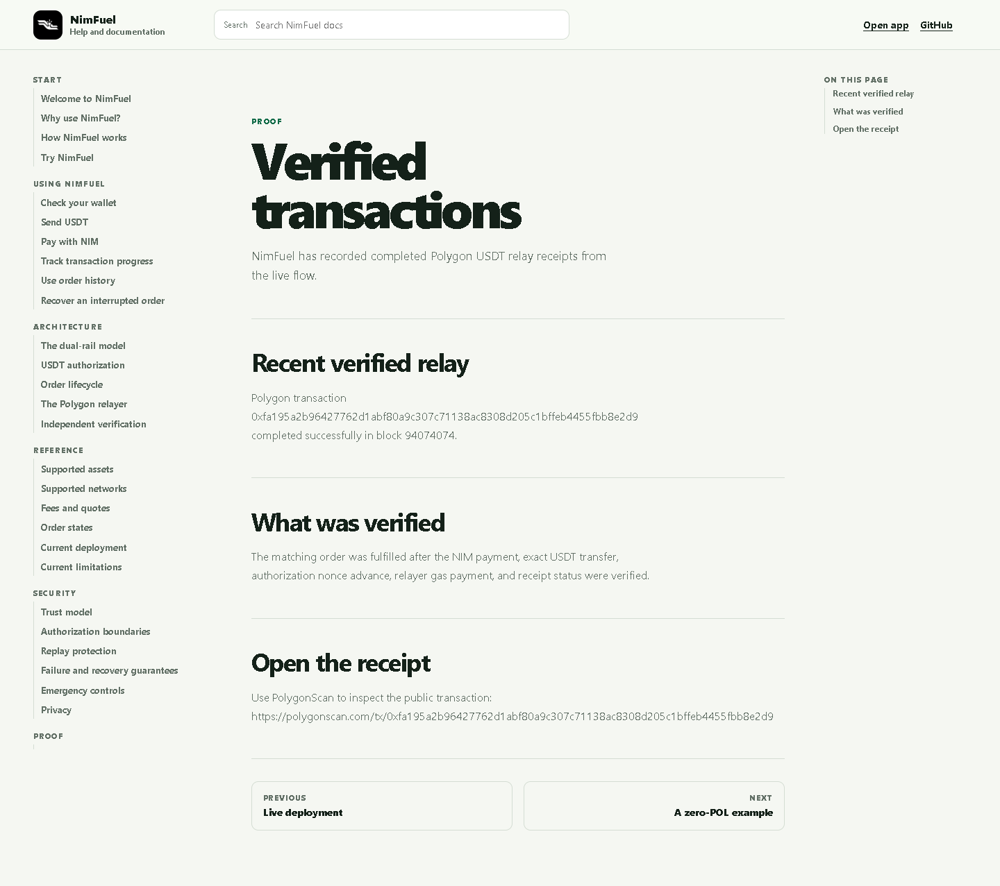
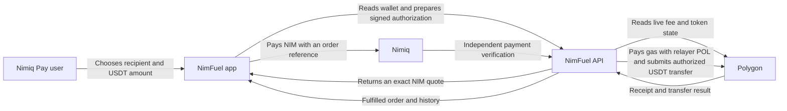
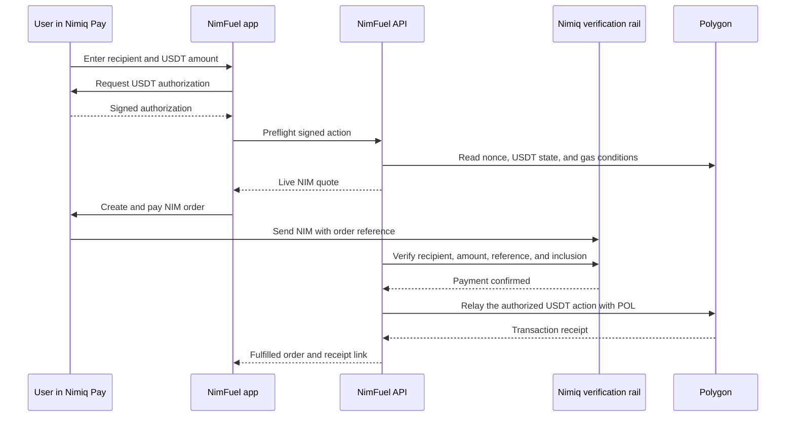

# NimFuel

> Use NIM to cover Polygon gas for a USDT action in Nimiq Pay.

[Open NimFuel](https://nimfuel-app.onrender.com) · [Read the docs](https://nimfuel-app.onrender.com/docs/start/introduction) · [Watch the 30-second launch video](https://youtu.be/2L5OR3LHh_U?si=tdeSk5OqM4vnFQjm)

NimFuel helps a Nimiq Pay user send Polygon USDT when their wallet has USDT but no POL for gas. The user chooses the recipient and amount, approves the exact USDT action in their wallet, pays the displayed NIM amount, and NimFuel verifies that payment before its relayer spends POL to submit the already-authorized transfer.

The user keeps control of the USDT action. NimFuel never asks for a seed phrase or private key.

## See it in action

[](https://youtu.be/2L5OR3LHh_U?si=tdeSk5OqM4vnFQjm)

<p align="center">
  
  
</p>

## The problem

A Polygon USDT transfer needs POL for gas. First-time Nimiq Pay users may have USDT in their Polygon wallet without holding POL, which leaves a valid transfer blocked at the final step.

NimFuel gives that user one clear path:

1. Check the connected Nimiq Pay and Polygon wallet.
2. Choose a recipient and any USDT amount accepted by the live service policy.
3. Approve the exact USDT authorization in Nimiq Pay.
4. Pay the live NIM quote using an order-specific reference.
5. Let NimFuel verify the NIM payment, relay with POL, and verify the Polygon receipt.

## How it works



The order follows a deliberate verification sequence:



## What NimFuel integrates

| Integration | Role in NimFuel |
| --- | --- |
| [Nimiq Mini App SDK](https://www.npmjs.com/package/@nimiq/mini-app-sdk) | Connects the Mini App to Nimiq Pay and its NIM and EVM wallet providers. |
| Nimiq | Receives the quoted NIM payment with an order-specific reference and provides independent payment confirmation. |
| Polygon | Hosts the USDT action. The relayer uses its own POL only after the matching NIM payment is confirmed. |
| Neon PostgreSQL | Stores durable orders, payment state, relay attempts, receipt details, and address-scoped history. |
| Render | Hosts the public Vite frontend and the native Node API. |

## Live product and proof

| Surface | Link |
| --- | --- |
| App | <https://nimfuel-app.onrender.com> |
| Documentation | <https://nimfuel-app.onrender.com/docs/start/introduction> |
| Verified transaction proof | <https://nimfuel-app.onrender.com/docs/proof/verified-transactions> |
| Launch video | <https://youtu.be/2L5OR3LHh_U?si=tdeSk5OqM4vnFQjm> |
| API health | <https://nimfuel-backend.onrender.com/health> |

The verified-proof page records a completed live Polygon USDT relay. It is evidence for that recorded transaction, not a blanket guarantee that every future transaction will succeed.

## Safety model

- The relayer private key stays on the server and never reaches the browser.
- The wallet signs the recipient, amount, token, chain context, nonce, and deadline.
- NimFuel verifies the NIM payment against the exact order before Polygon fulfillment is unlocked.
- Relay attempts and recovery states are durable. A retry stays attached to the same paid order and requires a fresh authorization when needed.
- Orders and history are scoped to the connected Polygon address.

Read [SECURITY.md](SECURITY.md) for the reporting process and operational boundaries.

## Run locally

Requirements: Node.js 20.19 or newer, a Nimiq Pay-compatible wallet context, and local environment values.

```bash
cd server
npm ci

cd ../app
npm ci
```

Create `app/.env.local` and `server/.env` using the variable names in [`.env.example`](.env.example). Keep all real credentials local. The relayer private key and database URL belong only in `server/.env` or the deployment provider's secret store.

Run the API and app in separate terminals:

```bash
cd server
npm run dev
```

```bash
cd app
npm run dev -- --host 0.0.0.0
```

The development app expects the API at `http://localhost:3001`.

## Verify the checkout

```bash
npm --prefix app run build
npm --prefix server run build
npm --prefix server run test:quote
npm --prefix server run test:durable
npm --prefix server run test:stage2
```

These checks verify the local checkout. They do not replace a live wallet approval, independent NIM payment verification, or a confirmed Polygon receipt.

## Repository map

| Path | Purpose |
| --- | --- |
| [`app/`](app) | Vite frontend and Nimiq Pay Mini App surface. |
| [`server/`](server) | Native Node API, quote service, payment verification, relay worker, and durable order store. |
| [`DEPLOYMENT.md`](DEPLOYMENT.md) | Environment and Render deployment guidance. |
| [`RUNBOOK.md`](RUNBOOK.md) | Operational checks, recovery, and release controls. |
| [`ROADMAP.md`](ROADMAP.md) | Current scope and future product directions. |
| [`docs/`](docs) | Public screenshots and supporting documentation assets. |

## Current scope

NimFuel currently supports the Polygon USDT flow shown here. It is not a wallet, bridge, swap service, or a general-purpose asset transfer layer. Broader onboarding, DEX, and multi-chain ideas remain future work until they have their own tested integration and recovery model.

## License

MIT. See [LICENSE](LICENSE).
